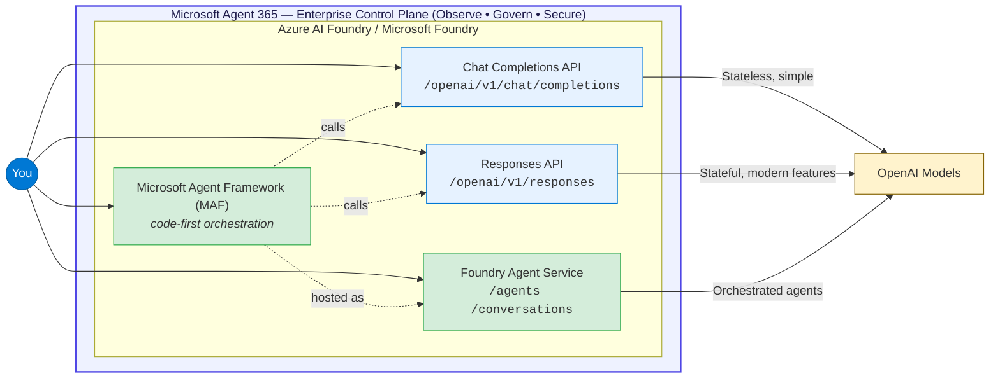
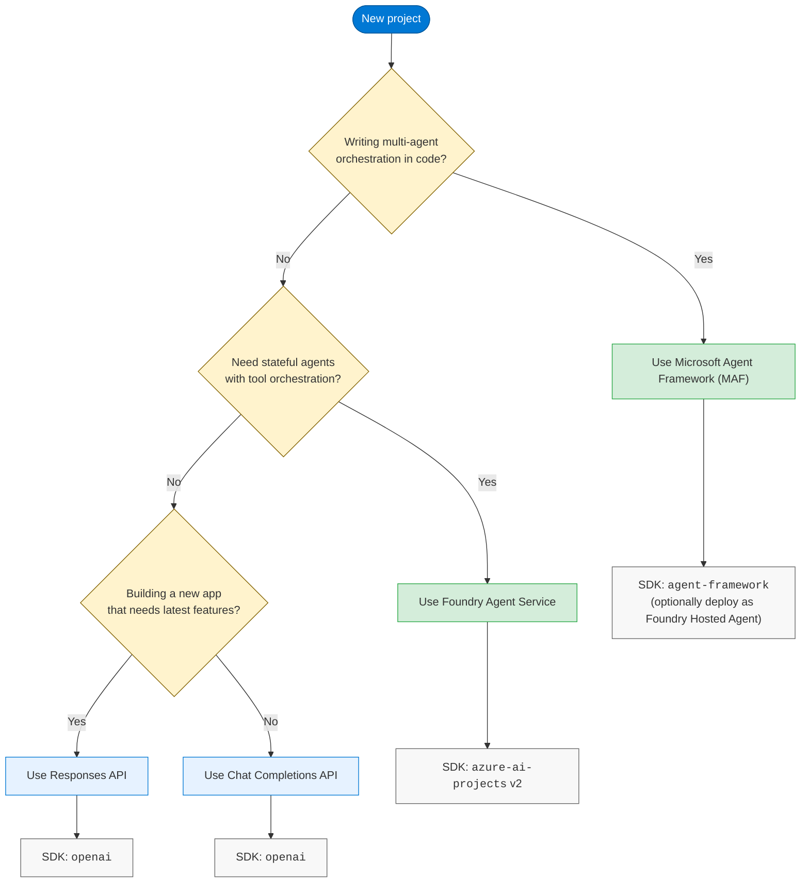
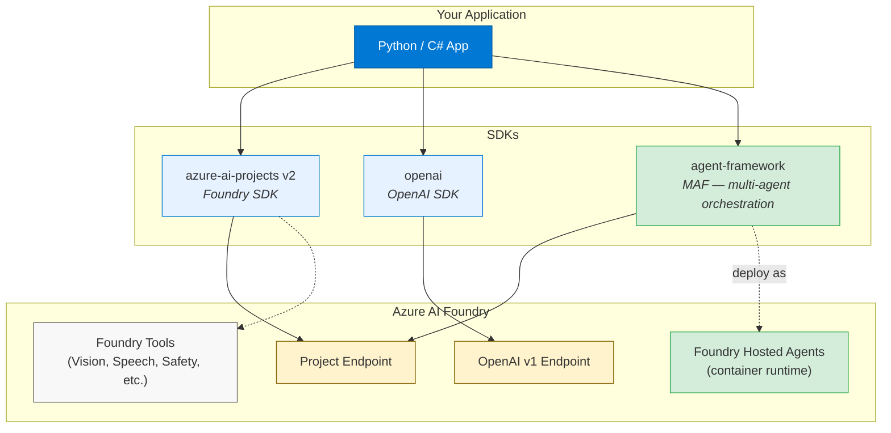

# Microsoft AI Agents Platform Guide (2026)

> **Covers:** `Chat Completions` · `Responses` · `Foundry Agent Service` · `Microsoft Agent Framework (MAF)` · `Microsoft Agent 365`
>
> **Last updated: 2026-05-19** — all docs synced against official Microsoft Learn sources.

A developer's map of the **Microsoft AI agents stack** as it stands in May 2026. The platform now spans four layers, and picking the right entry point depends on what you're building:

1. **Model APIs** — Chat Completions and Responses on `/openai/v1` for direct model calls.
2. **Hosted agent runtime** — Foundry Agent Service for server-managed conversations, tools, and identity.
3. **Code-first orchestration** — Microsoft Agent Framework (MAF) for multi-agent workflows in Python and .NET.
4. **Enterprise control plane** — Microsoft Agent 365 (GA May 1, 2026) for Observe / Govern / Secure across every agent in your tenant, regardless of framework.

This repo breaks each layer down, compares them side by side, and gives you the code patterns to get started. **Who it's for:** developers and architects deciding which API, SDK, or governance surface to adopt for a new or existing agent workload on Microsoft Foundry.

## The landscape at a glance

Three API surfaces, one platform. Each serves a different complexity tier:

| API Surface              | State Management | Best For                                    |
|--------------------------|------------------|---------------------------------------------|
| **Chat Completions**     | Client-managed   | Simple stateless chat, existing codebases   |
| **Responses**            | Optional server  | New apps, latest features, multi-turn state |
| **Foundry Agent Service** | Server-managed  | Production agents with tool orchestration   |

> [!NOTE]
> **Where does Microsoft Agent Framework (MAF) fit?** [MAF](https://learn.microsoft.com/en-us/agent-framework/overview/?pivots=programming-language-python) ([repo](https://github.com/microsoft/agent-framework)) is the **code-first orchestration SDK** (Python + .NET) that sits *above* these APIs. You write agents and graph-based multi-agent workflows in MAF; MAF calls Chat Completions / Responses under the hood and can deploy your agent as a **Foundry Hosted Agent** with ~2 extra lines of code. It is the direct successor to Semantic Kernel and AutoGen. See the [SDK Overview](docs/sdk-overview.md#microsoft-agent-framework-maf) for details.

> [!IMPORTANT]
> **Where does Microsoft Agent 365 fit?** [Microsoft Agent 365](https://learn.microsoft.com/en-us/microsoft-agent-365/overview) (**GA May 1, 2026**) is the enterprise **control plane** that wraps every agent in your tenant — regardless of which framework or cloud built it. Its three pillars are **Observe** (centralized agent registry, Agent Map, real-time telemetry), **Govern** (lifecycle, access control, and compliance via Entra + Purview + the M365 admin center), and **Secure** (Entra-backed Agent Identity, Purview DLP, Defender threat protection). Use the [Agent 365 SDK](https://learn.microsoft.com/en-us/microsoft-agent-365/developer/) and CLI to layer governed Work IQ tool access, notifications, Entra Agent Identity, and OpenTelemetry observability on agents built with MAF, Foundry Agent Service, Copilot Studio, OpenAI Agents SDK, LangChain — or even Google Vertex / AWS Bedrock. Agent 365 **does not host or build agents**; it makes them enterprise-ready.

## Which API should you use?

## Docs in this repo

This repo contains four deep-dive guides, each covering a different angle of the Azure OpenAI API story. Read them in order for a narrative flow, or jump directly to what you need.

| #  | Guide                                                                      | What You Learn                                                                           |
|----|----------------------------------------------------------------------------|------------------------------------------------------------------------------------------|
| 1  | [Quick Reference](docs/quick-reference.md)                                | Endpoint matrix, feature status, code snippets for all three APIs. **Start here.**       |
| 2  | [Chat Completions vs Responses](docs/chat-vs-responses.md)                | Detailed comparison of request shape, state handling, feature velocity, and capabilities. |
| 3  | [SDK Overview](docs/sdk-overview.md)                                      | Foundry SDK, OpenAI SDK, Foundry Tools, and Microsoft Agent Framework side by side.      |
| 4  | [Foundry Agent Service: Which API?](docs/agents-and-apis.md)              | Agent types, tool availability, hosted agents, publishing, and migration guidance.        |

## SDK ecosystem

> [!TIP]
> All Microsoft Foundry SDK development is consolidating into `azure-ai-projects` v2. The separate `azure-ai-agents` package has been dropped. See the [SDK Overview](docs/sdk-overview.md) for installation details.

## Key dates and migration

> [!IMPORTANT]
> - **March 31, 2026** — Classic Foundry Agent Service (threads/runs/messages pattern) was retired. New code must use the conversations/responses pattern. See the [migration section](docs/agents-and-apis.md#migration-from-classic-to-new) in the agent guide.
> - **May 1, 2026** — **Microsoft Agent 365 reached General Availability** for the Commercial segment (per-user licensing). Recommended companion products: Entra P1/P2 or Entra Suite, plus Purview DLP, to take full advantage of governance and protection. See the [Agent 365 overview](https://learn.microsoft.com/en-us/microsoft-agent-365/overview).

## Primary sources

* [Supported languages (Python pivot)](https://learn.microsoft.com/en-us/azure/ai-foundry/openai/supported-languages?view=foundry&tabs=dotnet-secure%2Csecure%2Cpython-entra&pivots=programming-language-python)
* [API version lifecycle](https://learn.microsoft.com/en-us/azure/ai-foundry/openai/api-version-lifecycle?view=foundry)
* [Foundry Agent Service overview](https://learn.microsoft.com/en-us/azure/ai-foundry/agents/overview)
* [Agent Service migration guide](https://learn.microsoft.com/en-us/azure/foundry/agents/how-to/migrate)
* [Responses API how-to](https://learn.microsoft.com/en-us/azure/ai-foundry/openai/how-to/responses?view=foundry)
* [Microsoft Agent 365 overview](https://learn.microsoft.com/en-us/microsoft-agent-365/overview)
* [Microsoft Agent 365 SDK and CLI (developer landing)](https://learn.microsoft.com/en-us/microsoft-agent-365/developer/)

## Contributing

Found something outdated or incorrect? Open an issue or submit a PR. These docs are maintained by checking them against Microsoft Learn sources and updating as APIs evolve.
