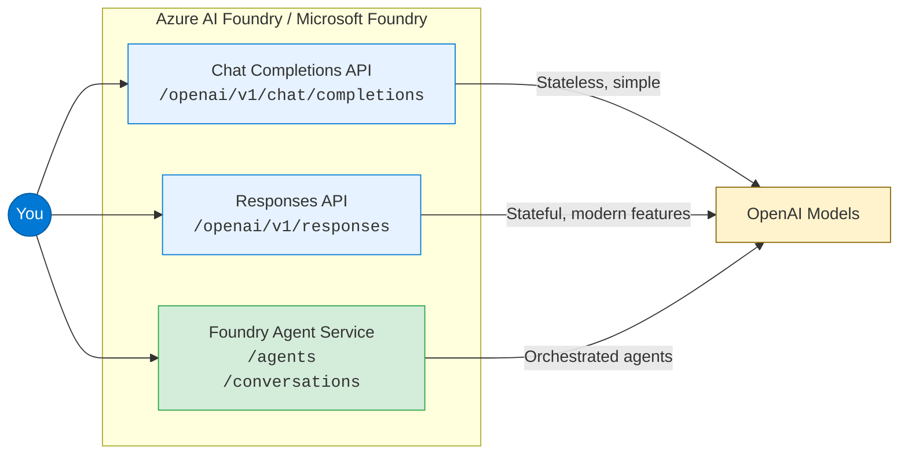
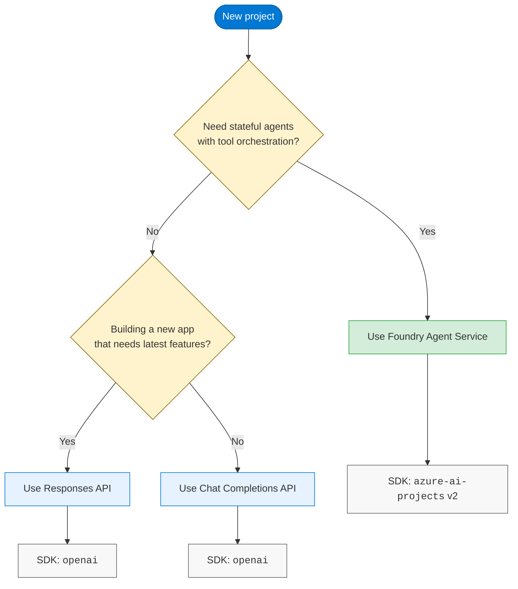
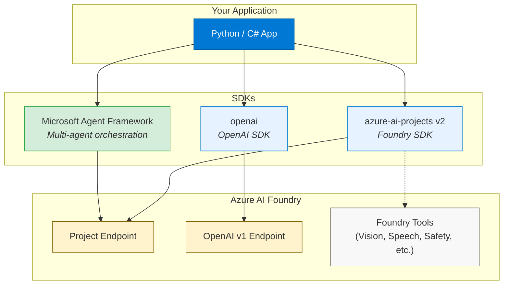

# Azure OpenAI API Guide (2026)

> **Last updated: 2026-03-22** — all docs synced against official Microsoft Learn sources.

Azure AI Foundry exposes multiple API surfaces for interacting with OpenAI models. Choosing the right one depends on your use case: a stateless chat, a feature-rich conversation, or a fully orchestrated agent. This repo breaks down the options, compares them side by side, and provides the code patterns you need to get started.

## The landscape at a glance

Three API surfaces, one platform. Each serves a different complexity tier:

| API Surface              | State Management | Best For                                    |
|--------------------------|------------------|---------------------------------------------|
| **Chat Completions**     | Client-managed   | Simple stateless chat, existing codebases   |
| **Responses**            | Optional server  | New apps, latest features, multi-turn state |
| **Foundry Agent Service** | Server-managed  | Production agents with tool orchestration   |

## Which API should you use?

## Docs in this repo

This repo contains four deep-dive guides, each covering a different angle of the Azure OpenAI API story. Read them in order for a narrative flow, or jump directly to what you need.

| #  | Guide                                                                      | What You Learn                                                                           |
|----|----------------------------------------------------------------------------|------------------------------------------------------------------------------------------|
| 1  | [Quick Reference](docs/quick-reference.md)                                | Endpoint matrix, feature status, code snippets for all three APIs. **Start here.**       |
| 2  | [Chat Completions vs Responses](docs/chat-vs-responses.md)                | Detailed comparison of request shape, state handling, feature velocity, and capabilities. |
| 3  | [SDK Overview](docs/sdk-overview.md)                                      | Foundry SDK, OpenAI SDK, Foundry Tools, and Microsoft Agent Framework side by side.      |
| 4  | [Foundry Agent Service: Which API?](docs/agents-and-apis.md)              | Agent types, tool availability, hosted agents, publishing, and migration guidance.        |

## SDK ecosystem

> [!TIP]
> All Microsoft Foundry SDK development is consolidating into `azure-ai-projects` v2. The separate `azure-ai-agents` package has been dropped. See the [SDK Overview](docs/sdk-overview.md) for installation details.

## Key dates and migration

> [!IMPORTANT]
> The classic Foundry Agent Service platform (threads/runs/messages pattern) retires **March 31, 2026**. Migrate to the new conversations/responses pattern before that date. See the [migration section](docs/agents-and-apis.md#migration-from-classic-to-new) in the agent guide.

## Primary sources

* [Supported languages (Python pivot)](https://learn.microsoft.com/en-us/azure/ai-foundry/openai/supported-languages?view=foundry&tabs=dotnet-secure%2Csecure%2Cpython-entra&pivots=programming-language-python)
* [API version lifecycle](https://learn.microsoft.com/en-us/azure/ai-foundry/openai/api-version-lifecycle?view=foundry)
* [Foundry Agent Service overview](https://learn.microsoft.com/en-us/azure/ai-foundry/agents/overview)
* [Agent Service migration guide](https://learn.microsoft.com/en-us/azure/foundry/agents/how-to/migrate)
* [Responses API how-to](https://learn.microsoft.com/en-us/azure/ai-foundry/openai/how-to/responses?view=foundry)

## Contributing

Found something outdated or incorrect? Open an issue or submit a PR. These docs are maintained by checking them against Microsoft Learn sources and updating as APIs evolve.
